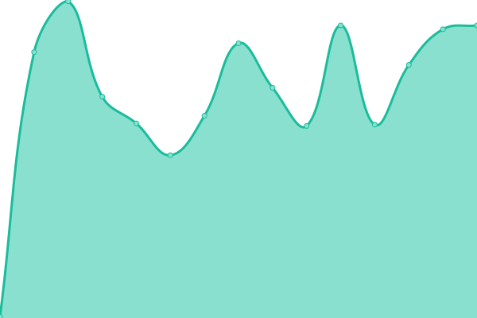
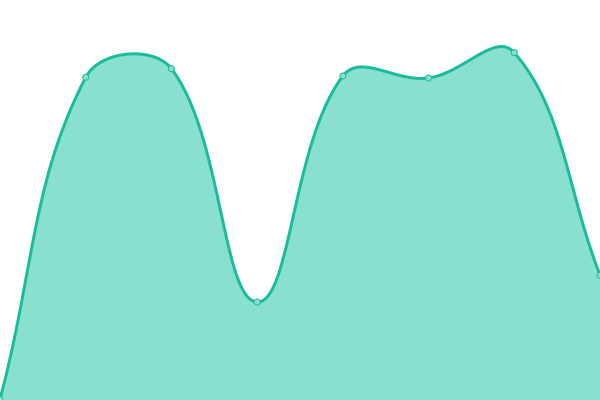

# [📈 Live Status](https://civteam-rgreenawalt.github.io/template-upptime-monitor): <!--live status--> **🟧 Partial outage**

This repository contains the open-source uptime monitor and status page for [civteam-rgreenawalt](https://civteam-rgreenawalt.github.io/template-upptime-monitor), powered by [Upptime](https://github.com/upptime/upptime).

With [Upptime](https://upptime.js.org), you can get your own unlimited and free uptime monitor and status page, powered entirely by a GitHub repository. We use [Issues](https://github.com/civteam-rgreenawalt/template-upptime-monitor/issues) as incident reports, [Actions](https://github.com/civteam-rgreenawalt/template-upptime-monitor/actions) as uptime monitors, and [Pages](https://civteam-rgreenawalt.github.io/template-upptime-monitor) for the status page.

<!--start: status pages-->
<!-- This summary is generated by Upptime (https://github.com/upptime/upptime) -->
<!-- Do not edit this manually, your changes will be overwritten -->
<!-- prettier-ignore -->
| URL | Status | History | Response Time | Uptime |
| --- | ------ | ------- | ------------- | ------ |
|  [Sparc](https://sparc.concorde2000.com) | 🟥 Down | [sparc.yml](https://github.com/civteam-rgreenawalt/template-upptime-monitor/commits/HEAD/history/sparc.yml) | 

 664ms
     
 | 

<a href="https://civteam-rgreenawalt.github.io/template-upptime-monitor/history/sparc">96.47%</a>
    

|  [Dodmets](https://dodmets.com) | 🟥 Down | [dodmets.yml](https://github.com/civteam-rgreenawalt/template-upptime-monitor/commits/HEAD/history/dodmets.yml) | 

 575ms
     
 | 

<a href="https://civteam-rgreenawalt.github.io/template-upptime-monitor/history/dodmets">98.66%</a>
    

|  [Af Dodmets](https://af.dodmets.com) | 🟩 Up | [af-dodmets.yml](https://github.com/civteam-rgreenawalt/template-upptime-monitor/commits/HEAD/history/af-dodmets.yml) | 

 3995ms
     
 | 

<a href="https://civteam-rgreenawalt.github.io/template-upptime-monitor/history/af-dodmets">78.88%</a>
    

|  [Concorde2000](https://concorde2000.com) | 🟥 Down | [concorde2000.yml](https://github.com/civteam-rgreenawalt/template-upptime-monitor/commits/HEAD/history/concorde2000.yml) | 

 0ms
     
 | 

<a href="https://civteam-rgreenawalt.github.io/template-upptime-monitor/history/concorde2000">0.00%</a>
    

|  [Civteam](https://civteam.com) | 🟩 Up | [civteam.yml](https://github.com/civteam-rgreenawalt/template-upptime-monitor/commits/HEAD/history/civteam.yml) | 

 469ms
     
 | 

<a href="https://civteam-rgreenawalt.github.io/template-upptime-monitor/history/civteam">100.00%</a>
    

|  [Drivers Clearinghouse](https://www.driversclearinghouse.com) | 🟩 Up | [drivers-clearinghouse.yml](https://github.com/civteam-rgreenawalt/template-upptime-monitor/commits/HEAD/history/drivers-clearinghouse.yml) | 

 257ms
     
 | 

<a href="https://civteam-rgreenawalt.github.io/template-upptime-monitor/history/drivers-clearinghouse">100.00%</a>
    

<!--end: status pages-->

[**Visit our status website →**](https://civteam-rgreenawalt.github.io/template-upptime-monitor)

## 📄 License

- Powered by: [Upptime](https://github.com/upptime/upptime)
- Code: [MIT](./LICENSE) © [Anand Chowdhary](https://anandchowdhary.com), supported by [Pabio](https://pabio.com)
- Data in the `./history` directory: [Open Database License](https://opendatacommons.org/licenses/odbl/1-0/)
